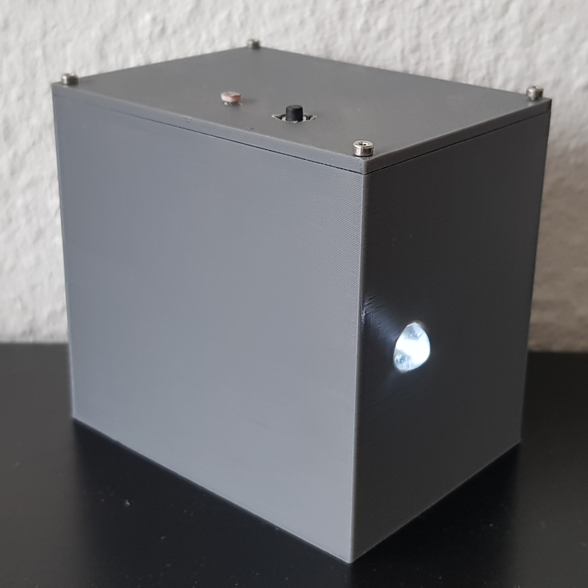
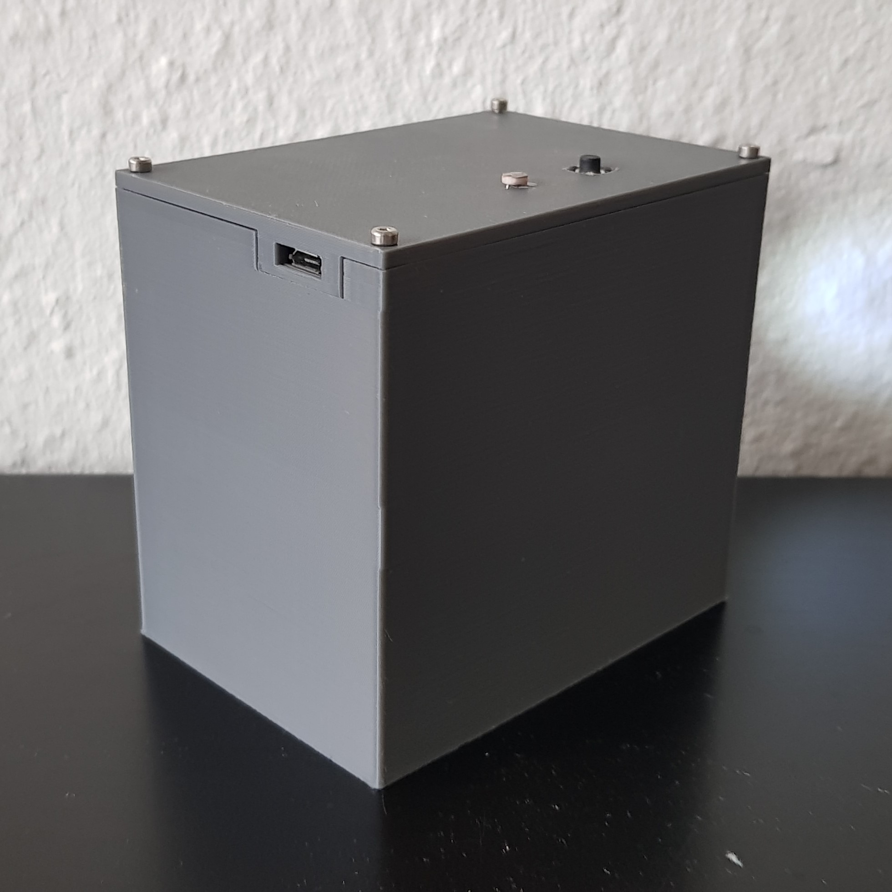
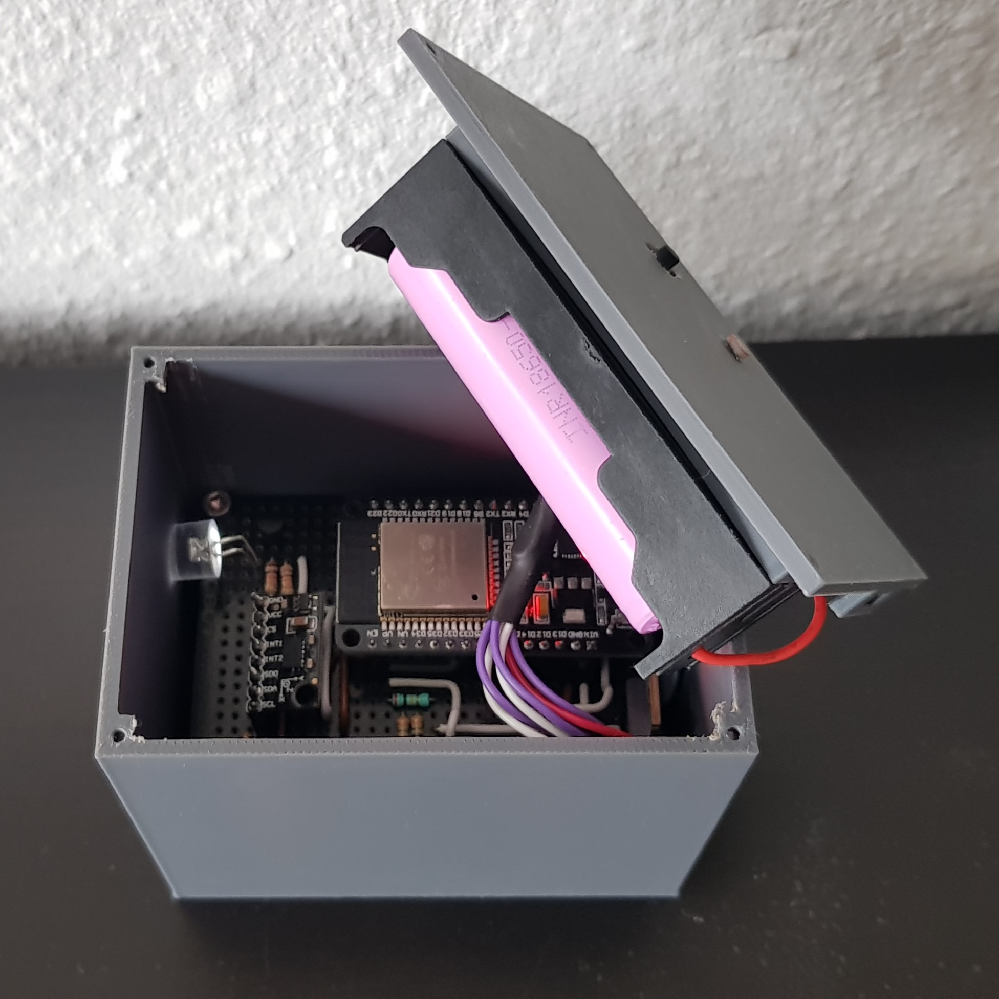
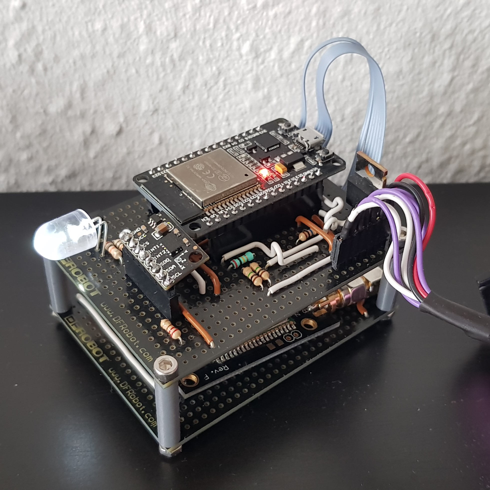

# 34346-IoT_Project_Group6
This repository contains the source code to build a smart bike light with geolocation for the DTU Course 34346.

<table style="border-collapse: collapse; width: 100%;">
  <tr>
    <td>
      
      
(a) Front

    </td>
    <td>
      
      
(b) Back

    </td>
  </tr>
  <tr>
    <td>
      
      
(c) Open

    </td>
    <td>
      
      
(d) Stack

    </td>
  </tr>
</table>

**Figure:** Prototype outside and inside

## Backend and Web App
The source code for the backend and Web App can be found [here](https://github.com/Ramm23/IoT_BikeLight_App)

## Repository Structure
This application is build using the ESP-IDF v5.4.0. The directory structure is the following:

### /main
Contains headers and source files. Utility modules are prefixed with "*u*" and functional modules with "*m*". This directory contains all modules which have interdependecies.

### /components
The ESP-IDF uses components, which are libraries. In this directory one can find two libraries which have no dependecies custom modules, the *ubxlib*  from ublox which is cloned from the now archived [ubxlib repository](https://github.com/u-blox/ubxlib) and the *adxl345* component which is a custom component. The *ubxlib* library does not support the M6 module which was used in this project. However the protocol is very similar and hence only small changes were necessary to adapt it for the use with the M6 module.

## Building
It is recommended to follow [Espressifs Build Instructions](https://docs.espressif.com/projects/esp-idf/en/v5.4.1/esp32/api-guides/build-system.html) to build the application. All relevant source files must be in the CMakeLists and and the top level domain must specify the *ubxlib* as an extra components. 

### KConfig - Project Configuration
This project uses KConfig for configuring LoRaWAN keys. Before building open set them by using the IDF menuconfig. The following keys must be defined:
- appkey
- appeui
- deveui

## Documentation
Please refer to all header files to read all functions description.

## TODO
|   Item   |  Severity    | Difficulty|
| ---- | ---- | ---- |
|Refactor the core state machine| Medium |High|
|Save if stolen in NVS such that a power-cycle does not reset the device to normal operation|Medium|Easy|
|Test performance with continous use. Identify potential bug that (maybe?) prevents sleep after multiple hours. |High|High|
| Investigate full utilization of ADXL module, for example 'link mode' to reduce manual reconfigurations and 'auto sleep' for marginal power savings of a few μA |Low |Medium|
| Improve Button debouncing, maybe in concurrent task instead of interrupts. | Medium | Easy |
| Add long button press to lock LED state to inhibit auto-off on inactivity | Low | Medium |
| Similar to light-off on inactivity while active, add a light-on on activity while the core programm is waiting for a lora transmission to finish. This is mostly relevant to enable activity wakeup on the inital boot | Medium | Medium |
